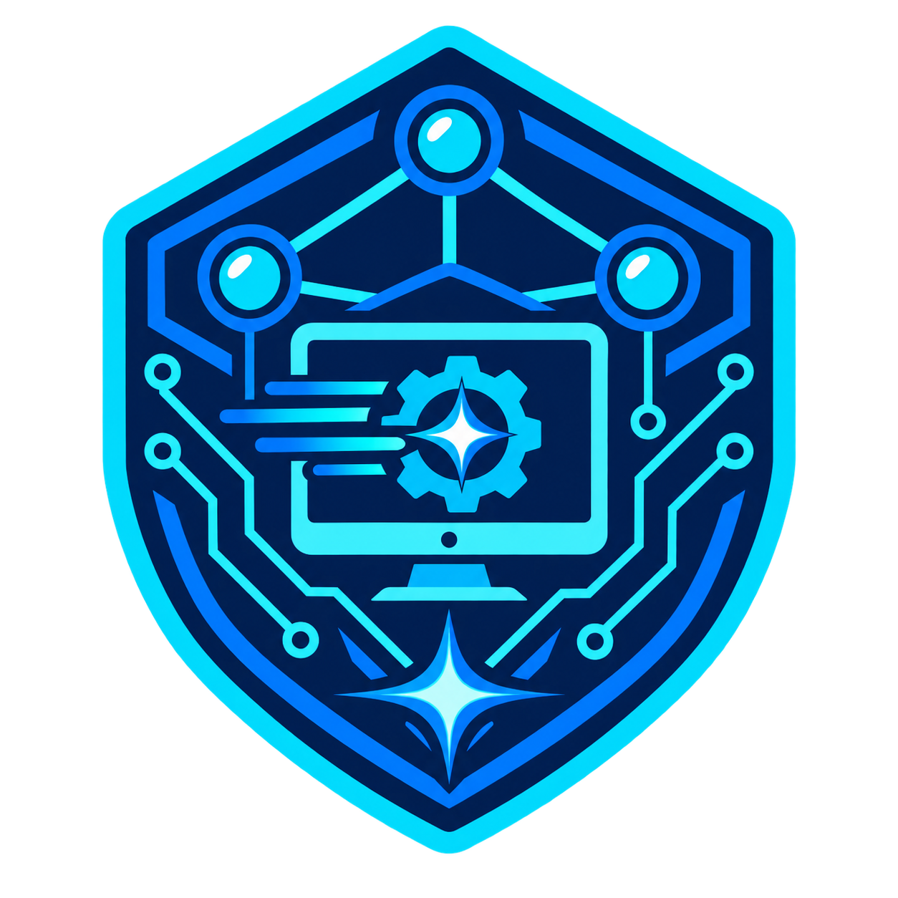

<p align="center">
  
</p>

# NetSec Windows Setup

تطبيق Windows مباشر لإعداد جهاز جديد لمهام البرمجة والشبكات والأمن المعلوماتي. يفتح المستخدم ملفًا واحدًا باسم `NetSecSetup.exe`، يختار التطبيقات، ثم يضغط زر التثبيت — من دون كتابة أوامر PowerShell أو تثبيت .NET أو VS Code أو Git مسبقًا.

## المزايا

- واجهة رسومية مباشرة مع وضعي النهار والليل.
- حزم مرتبة حسب المجال: الأساسيات، التطوير، المتصفحات، الشبكات والأمن، والهندسة العكسية.
- تثبيت تلقائي للاعتمادات الضرورية: Docker Desktop يضيف WSL، وGhidra يضيف Java JDK 21 عند الحاجة.
- سجل واضح لنتيجة كل عملية تثبيت.

## الحزم في الإصدار الأول

| المجال | التطبيقات |
| --- | --- |
| الأساسيات | WinRAR أو 7-Zip |
| التطوير | WSL + Ubuntu، .NET SDK، VS Code، Python، Git، Docker Desktop |
| المتصفحات | Brave، Google Chrome، DuckDuckGo Browser |
| الشبكات والأمن | GNS3، Nmap، Wireshark، Proton VPN |
| الهندسة العكسية | Ghidra مع Java JDK 21 تلقائيًا |

WinRAR و7-Zip بديلان؛ اختيار أحدهما يلغي الآخر. يحتاج Proton VPN إلى تسجيل الدخول إلى حسابك بعد تثبيته.

## استخدام التطبيق الجاهز

- Windows 10 أو Windows 11.
- اتصال إنترنت.
- قبول نافذة الصلاحيات الإدارية في Windows؛ هذا مطلوب خصوصًا لتثبيت WSL.
- `winget` / **App Installer**؛ يكون موجودًا عادةً في Windows 11. إن لم يكن موجودًا، يفتح التطبيق صفحته الرسمية في Microsoft Store.

هذه متطلبات نظام Windows، وليست برامج ينبغي للمستخدم تثبيتها يدويًا قبل تشغيل التطبيق.

## بناء التطبيق والنشر

صاحب المشروع يبني التطبيق مرة واحدة فقط، ثم يرفع ملف `NetSecSetup.exe` الناتج إلى قسم **Releases** في GitHub. أي مستخدم يمكنه تنزيل الملف وتشغيله مباشرة بعد ذلك.

تعليمات البناء التفصيلية موجودة في [BUILD.md](BUILD.md). باختصار: انقر مرتين على `Build-PortableExe.cmd`، ثم ستجد ملف التطبيق في `publish\NetSecSetup.exe`.

هذا الإصدار يستعمل .NET Framework الموجود أساسًا في Windows 10 و11، لذلك لا يحتاج ملف التشغيل إلى .NET SDK أو حزم NuGet أو أي تنزيلات مسبقة.

## ملاحظات مهمة

- بعد تثبيت WSL أو Docker Desktop قد تحتاج إلى إعادة تشغيل الكمبيوتر، ثم فتح Ubuntu لأول مرة لإنشاء اسم مستخدم وكلمة مرور لينكس.
- يحتاج Docker Desktop إلى تفعيل الافتراضية الافتراضية من BIOS/UEFI على بعض الأجهزة.
- GNS3 هو البرنامج الأساسي فقط؛ صور الأجهزة، وGNS3 VM، وCisco Packet Tracer ليست جزءًا من التثبيت التلقائي لأنّها تتطلب تنزيلات أو تراخيص منفصلة.
- الحزم وخيارات الواجهة موجودة في [Program.cs](src/NetSecSetupClassic/Program.cs).

## النشر على GitHub

```powershell
git init
git add .
git commit -m "Initial Windows setup installer"
git branch -M main
git remote add origin https://github.com/YOUR-USERNAME/NetSec-Windows-Setup.git
git push -u origin main
```

استبدل `YOUR-USERNAME` باسم المستخدم الخاص بك، وأنشئ مستودعًا فارغًا بالاسم نفسه في GitHub قبل تنفيذ السطرين الأخيرين.

## الترخيص

المشروع متاح بموجب ترخيص MIT. راجع ملف [LICENSE](LICENSE).
